# 🔍 DevFinder

<p align="center">
  
  
  
  
  
  
</p>

An AI-powered developer opportunity discovery platform. DevFinder unifies open-source repository search, real-time remote job aggregation, and internship discovery into a single dashboard. Backed by **Groq AI (Llama 3.1)**, it generates technical repository summaries, estimates project difficulty, and offers personalized repository suggestions based on your skillset.

🔗 **Production Site:** [devfinder-pied-eta.vercel.app](https://devfinder-pied-eta.vercel.app)  
📂 **Source Code:** [github.com/jasinthashankar/Devfinder.git](https://github.com/jasinthashankar/Devfinder.git)

---

## 📖 Table of Contents

- [🔍 DevFinder](#-devfinder)
  - [📖 Table of Contents](#-table-of-contents)
  - [🚀 Overview](#-overview)
    - [The Problem](#the-problem)
    - [The Solution](#the-solution)
    - [Core Objectives](#core-objectives)
  - [✨ Features](#-features)
  - [🛠️ Technology Stack](#-technology-stack)
  - [📐 System Architecture](#-system-architecture)
    - [Mermaid System Design](#mermaid-system-design)
    - [Application workflow (Alerts & APScheduler)](#application-workflow-alerts--apscheduler)
  - [📁 Folder Structure](#-folder-structure)
  - [⚙️ Setup & Installation](#-setup--installation)
    - [Prerequisites](#prerequisites)
    - [1. Database Configuration (Supabase)](#1-database-configuration-supabase)
    - [2. Backend Setup (FastAPI)](#2-backend-setup-fastapi)
    - [3. Frontend Setup (React & Vite)](#3-frontend-setup-react--vite)
  - [🔐 Environment Variables](#-environment-variables)
    - [Backend Configuration (`backend/.env`)](#backend-configuration-backendenv)
    - [Frontend Configuration (`frontend/.env`)](#frontend-configuration-frontendenv)
  - [🧑‍💻 Usage Guide & User Journeys](#-usage-guide--user-journeys)
    - [1. User Onboarding & OAuth](#1-user-onboarding--oauth)
    - [2. Finding Repositories & AI Insights](#2-finding-repositories--ai-insights)
    - [3. Smart Recommendations](#3-smart-recommendations)
    - [4. Custom Opportunity Alerts](#4-custom-opportunity-alerts)
    - [5. Job & Internship Board](#5-job--internship-board)
    - [6. Admin Dashboard](#6-admin-dashboard)
  - [📸 App Screenshots](#-app-screenshots)
    - [Dashboard & Authentication](#dashboard--authentication)
    - [Discovery & Opportunities](#discovery--opportunities)
    - [Personalization & Admin](#personalization--admin)
  - [🛡️ Security Implementation](#-security-implementation)
  - [⚡ Performance Optimizations](#-performance-optimizations)
  - [⚠️ Known Limitations](#-known-limitations)
  - [🗺️ Future Roadmap](#-future-roadmap)
  - [🤝 Contributing](#-contributing)
  - [📄 License](#-license)
  - [👥 Authors](#-authors)

---

## 🚀 Overview

### The Problem
Developers frequently spend hours hopping between GitHub search, various remote job boards, and community lists like `goodfirstissue.dev` or `Up For Grabs` to find repositories to contribute to, open issues to tackle, or internships and jobs to apply for. This fragmented workflow distracts from coding, learning, and expanding developer portfolios.

### The Solution
**DevFinder** solves this problem by acting as an aggregate center. It pulls live repository data from the GitHub API and extracts remote developer positions from multiple industry aggregators. Instead of generic searches, DevFinder uses **Llama 3.1 (via the Groq API)** to parse complex GitHub repositories, generate clean 2-sentence summaries, list required skills, and rank projects against the developer's self-declared skills.

### Core Objectives
1. **Consolidated Opportunity Board**: Explore open-source projects, issues, full-time jobs, and internships in one unified dashboard.
2. **AI-Driven Personalization**: Rank and extract key takeaways from open-source projects using fast, serverless LLM execution.
3. **Automated Notification Loops**: Run background scans to discover matches and notify users via emails automatically.

---

## ✨ Features

- **🔐 Robust Auth Options**: Register via traditional email/password credentials or authenticate instantly using secure **GitHub OAuth**.
- **🔍 Live Repository Explorer**: Execute real-time queries against the GitHub API. Filter projects by coding language, stars count, and difficulty.
- **💼 Unified Job Board**: Real-time aggregation of remote developer jobs from **RemoteOK**, **Arbeitnow**, and **Adzuna**.
- **🎓 Smart Internship Search**: Filters and ranks internships, entry-level, and trainee roles using custom keyword scoring algorithms.
- **🤖 Groq AI Recommendations**: Input your current skill set and receive dynamic, ranked open-source suggestions powered by Llama 3.1.
- **🔔 Customized Email Alerts**: Set custom star thresholds and key language criteria. An integrated background worker monitors repositories and sends alert reports via the **Resend API**.
- **📊 Admin Control Center**: Monitor system usage, active user signups, total alert distributions, and graphical breakdowns of popular languages using **Recharts**.
- **🌓 Adaptive Interface**: Toggle between modern Dark and Light mode themes. Full responsiveness on mobile, tablet, and desktop viewports.

---

## 🛠️ Technology Stack

| Layer | Technology | Version | Purpose |
|---|---|---|---|
| **Frontend** | React | `^19.2.6` | Component-based UI library |
| | React Router Dom | `^7.17.0` | Application routing & protected route layouts |
| | Tailwind CSS | `^4.3.1` | Utility-first styling framework |
| | Recharts | `^3.8.1` | Analytics charts & visualizations |
| | Axios | `^1.18.0` | Promise-based HTTP client |
| | Lucide React | `^1.18.0` | Modern, consistent icon library |
| **Backend** | FastAPI | `0.111.0` | High-performance Python ASGI framework |
| | Uvicorn | `0.30.1` | ASGI server implementation |
| | Pydantic | `2.8.2` | Data validation and settings management |
| | SlowAPI | `0.1.9` | Rate-limiting middleware for API security |
| | APScheduler | `3.10.4` | Background execution worker |
| **Database** | Supabase | `2.5.0` | PostgreSQL backend client & database |
| **AI Engine** | Groq API (Llama 3.1) | `0.9.0` | High-speed LLM inference for repository analysis |
| **Email Service** | Resend API | `2.0.0` | Delivery service for alerts and confirmations |

---

## 📐 System Architecture

### Mermaid System Design
The frontend React application communicates securely with the FastAPI backend using JWT tokens. The backend coordinates data flow between the Supabase database and third-party APIs (GitHub, Groq, Resend, and Job boards).

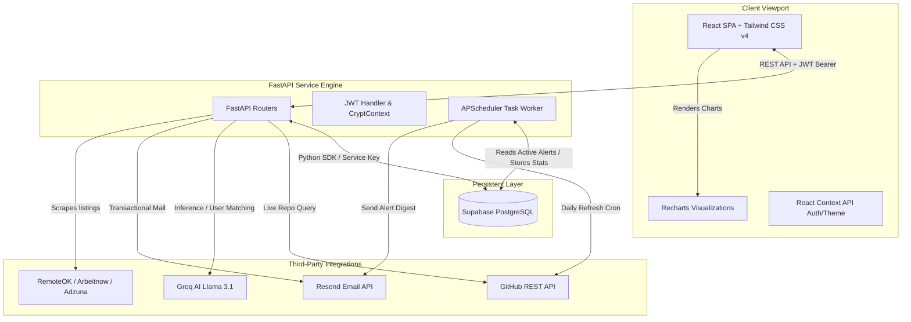

### Application workflow (Alerts & APScheduler)
This sequence shows the onboarding registration step, setting custom alerts, and the asynchronous background scheduler executing a Daily Opportunity alert check.

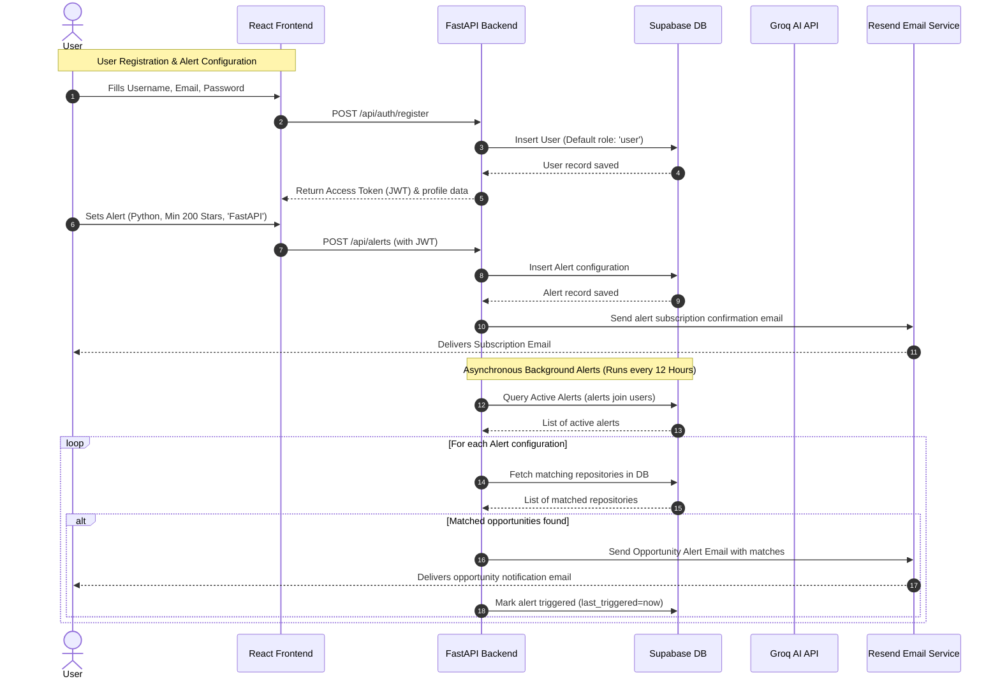

---

## 📁 Folder Structure

```
devfinder/
├── backend/
│   ├── api/                 # Endpoint routes: auth, repos, jobs, alerts, saved, stats
│   ├── auth/                # JWT encoder/decoder, CryptContext password hashing
│   ├── database/            # Supabase database initialization and wrapper queries
│   ├── models/              # Pydantic schemas for payload validation
│   ├── scheduler/           # APScheduler configuration for cron jobs
│   ├── services/            # API wrappers (GitHub, Groq AI, Job sources, Resend)
│   ├── utils/               # App configuration loaders, environment validator, and filters
│   ├── main.py              # Entrypoint file, CORS middleware, and API configuration
│   └── requirements.txt     # Python backend dependencies list
├── frontend/
│   ├── src/
│   │   ├── components/      # UI components: AppLayout, RepoCard, JobCard, FilterBar
│   │   ├── context/         # AuthContext, ThemeContext, ToastContext
│   │   ├── hooks/           # Custom React hooks
│   │   ├── pages/           # Route views: Home, Repos, Jobs, Recommendations, Alerts
│   │   ├── services/        # Axios API configurations and service calls
│   │   └── utils/           # Helper scripts and formatters
│   ├── index.html           # Main HTML entrypoint
│   ├── package.json         # Node.js packages and startup scripts
│   ├── tailwind.config.js   # Tailwind directives
│   └── vite.config.js       # Vite development configuration
├── database/
│   └── schema.sql           # Database tables, indexes, and RLS policies
└── assets/
    └── screenshots/         # Walkthrough PNG screenshots
```

---

## ⚙️ Setup & Installation

### Prerequisites
Make sure you have the following installed on your machine:
- **Node.js** (v18 or higher)
- **Python** (v3.10 or higher)
- **PostgreSQL** (or a **Supabase** cloud database account)

---

### 1. Database Configuration (Supabase)
1. Register or Log in to [Supabase](https://supabase.com).
2. Create a new project and open the **SQL Editor** from the sidebar.
3. Click **New Query**, copy the contents of `database/schema.sql`, and execute it to create all tables and indexes.
4. Go to **Project Settings → API** and copy:
   - **Project URL** (needed for `SUPABASE_URL`)
   - **service_role key** (needed for `SUPABASE_SERVICE_KEY` — this key is kept private on the backend to bypass RLS policies).

---

### 2. Backend Setup (FastAPI)
Navigate to the backend directory, initialize a Python virtual environment, install dependencies, and setup configuration.

```bash
# Navigate to backend
cd backend

# Create virtual environment
python -m venv venv

# Activate virtual environment
# On Windows (Command Prompt/PowerShell):
venv\Scripts\activate
# On Linux/macOS:
source venv/bin/activate

# Install required python packages
pip install -r requirements.txt

# Copy environment variables file
cp .env.example .env
```

Edit `backend/.env` with your Supabase credentials, Groq API key, Resend API key, and GitHub token. (See the [Environment Variables](#-environment-variables) section below for explanations).

Once configured, run the backend:

```bash
# Start backend server with auto-reload
python main.py
```
The server will start on `http://localhost:8000`. You can explore interactive API documentation at `http://localhost:8000/docs`.

---

### 3. Frontend Setup (React & Vite)
Navigate to the frontend directory, install npm packages, copy the environment configuration, and boot the Vite server.

```bash
# Navigate to frontend
cd ../frontend

# Install dependencies
npm install

# Copy environment template
cp .env.example .env
```

Edit `frontend/.env` to point to the backend server and configure the GitHub Client ID:

```env
VITE_API_URL=http://localhost:8000
VITE_GITHUB_CLIENT_ID=Ov23liafAOqd3QgVn9Xe
```

Once configured, launch the client app:

```bash
# Run development server
npm run dev
```

Open your browser and navigate to `http://localhost:5173/`.

---

## 🔐 Environment Variables

### Backend Configuration (`backend/.env`)
Create this file in the `backend/` directory:

```env
# Supabase Database Configuration
SUPABASE_URL=https://your-project.supabase.co
SUPABASE_SERVICE_KEY=your-supabase-service-role-key-never-expose

# JWT Token Settings
JWT_SECRET_KEY=generate-a-32-byte-hex-string
JWT_ALGORITHM=HS256
ACCESS_TOKEN_EXPIRE_MINUTES=10080

# Groq AI Integration (Llama 3.1)
GROQ_API_KEY=gsk_your-groq-api-key-here
GROQ_MODEL=llama-3.1-8b-instant

# GitHub API Integration (Optional but highly recommended)
GITHUB_TOKEN=ghp_your-github-personal-access-token

# GitHub OAuth App Configuration
GITHUB_CLIENT_ID=your-github-oauth-client-id
GITHUB_CLIENT_SECRET=your-github-oauth-client-secret

# Resend Transactional Email API (Optional)
RESEND_API_KEY=re_your-resend-api-key-here
RESEND_FROM_EMAIL=alerts@yourverifieddomain.com

# Adzuna Jobs API Configuration (Optional)
ADZUNA_APP_ID=your-adzuna-app-id
ADZUNA_APP_KEY=your-adzuna-app-key

# Server Execution Bindings
HOST=0.0.0.0
PORT=8000
FRONTEND_URL=http://localhost:5173
```

---

### Frontend Configuration (`frontend/.env`)
Create this file in the `frontend/` directory:

```env
VITE_API_URL=http://localhost:8000
VITE_GITHUB_CLIENT_ID=your-github-oauth-client-id
```

---

## 🧑‍💻 Usage Guide & User Journeys

### 1. User Onboarding & OAuth
- Users can create a standard email account or click **Continue with GitHub** to authenticate via OAuth.
- On first-time GitHub login, a user account is automatically provisioned, extracting the verified primary email address directly from the GitHub API.

### 2. Finding Repositories & AI Insights
- Go to the **Repositories** tab.
- Type search parameters (e.g. `dashboard` or `rust`), select a language, and set a minimum star filter.
- The interface fetches directly from the GitHub API. Hovering over a card shows an AI tag. Clicking a card requests the FastAPI backend to fetch, summarize, and rate the repository difficulty (`Beginner`, `Intermediate`, `Advanced`). The summary details *what the project does*, *learning values*, and *career relevance*.
- Users can save/bookmark repositories to their profile.

### 3. Smart Recommendations
- Navigate to the **Recommendations** tab.
- Click suggested skill chips (e.g., Python, React, Docker) or type your own.
- Click **Generate Recommendations**. Groq AI evaluates candidate projects, scores matching criteria, and returns the top 10 ranked recommendations.

### 4. Custom Opportunity Alerts
- Navigate to the **Alerts** tab.
- Set up active trackers by entering a target language, minimum star rating, and search keywords.
- Click **Create Alert**. You will receive an email confirmation. Every 12 hours, the background scheduler checks for newly matched repositories and sends an opportunity email with clickable project links.

### 5. Job & Internship Board
- Visit **Jobs** or **Internships**.
- Browse listings aggregated from RemoteOK, Arbeitnow, and Adzuna. Filter by tech stacks or locations.
- Internship listings are automatically parsed and scored to isolate trainee and junior positions, helping entry-level developers launch their careers.

### 6. Admin Dashboard
- Users updated with the `role = 'admin'` flag in the database can access the **Admin** panel.
- This view offers system metrics (total users, active repository count, active alerts, API searches logged) and displays a language popularity bar chart built on top of user searches and open alerts.

---

## 📸 App Screenshots

### Dashboard & Authentication
<table width="100%">
  <tr>
    <td width="50%">
      <p align="center"><b>Login Screen</b></p>
      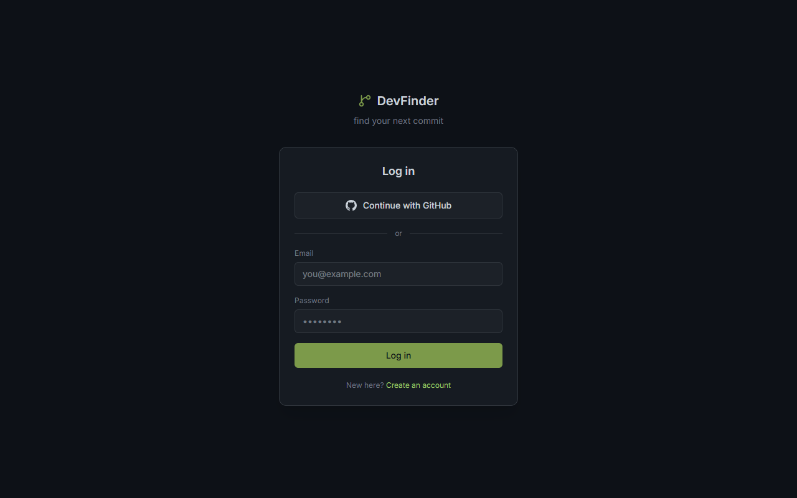
    </td>
    <td width="50%">
      <p align="center"><b>Create Account</b></p>
      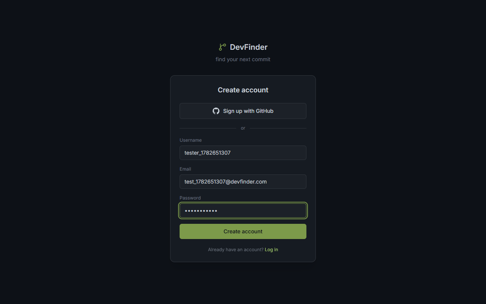
    </td>
  </tr>
  <tr>
    <td colspan="2">
      <p align="center"><b>Main Discovery Hub (Home)</b></p>
      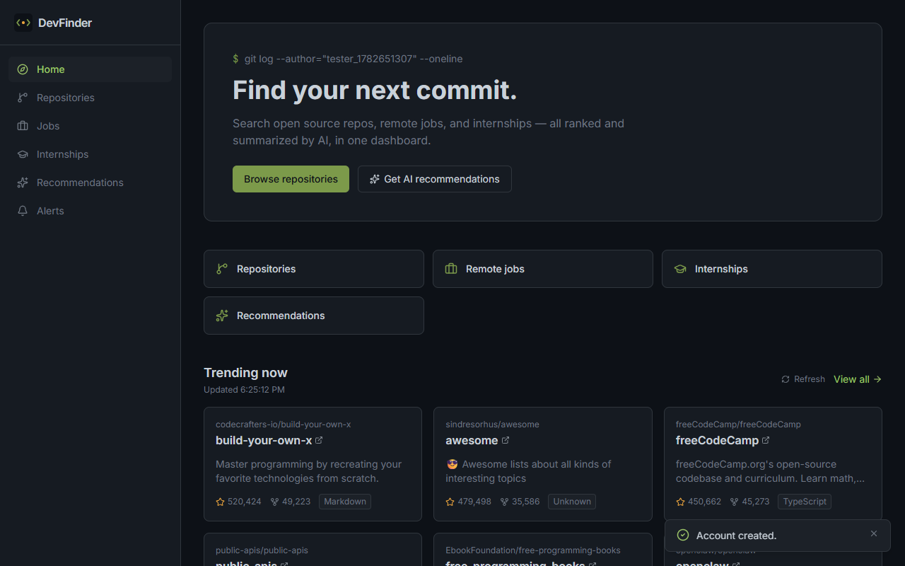
    </td>
  </tr>
</table>

### Discovery & Opportunities
<table width="100%">
  <tr>
    <td width="50%">
      <p align="center"><b>Live Repository Explorer (GitHub API)</b></p>
      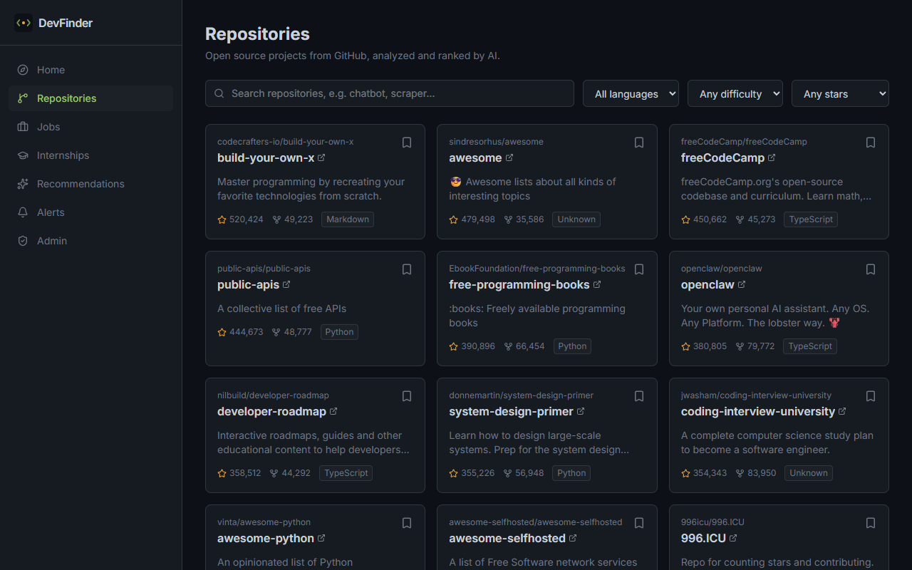
    </td>
    <td width="50%">
      <p align="center"><b>AI Recommendations (Groq AI)</b></p>
      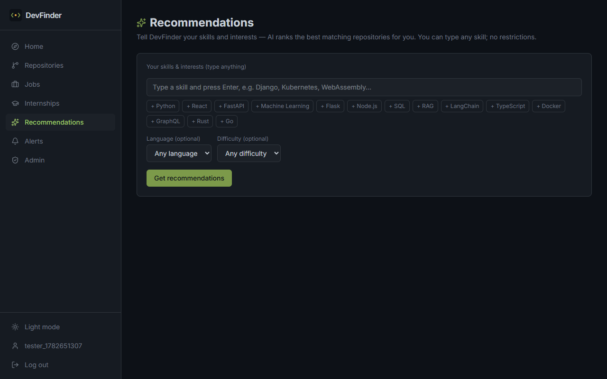
    </td>
  </tr>
  <tr>
    <td width="50%">
      <p align="center"><b>Unified Jobs Board</b></p>
      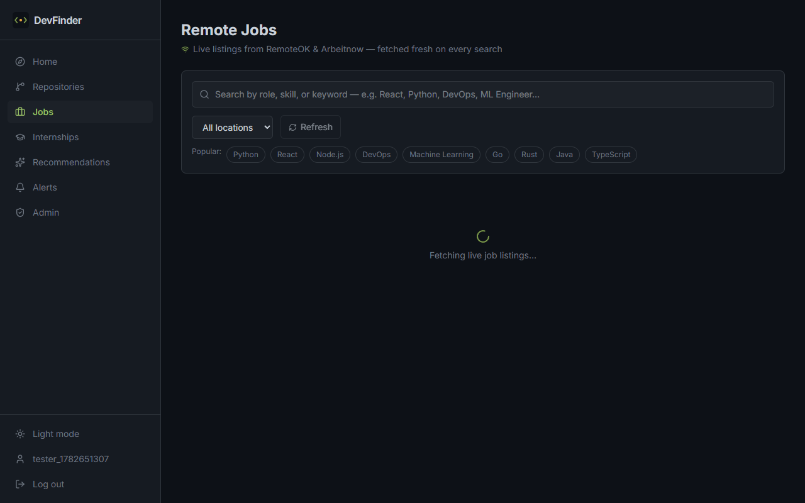
    </td>
    <td width="50%">
      <p align="center"><b>Internship Finder</b></p>
      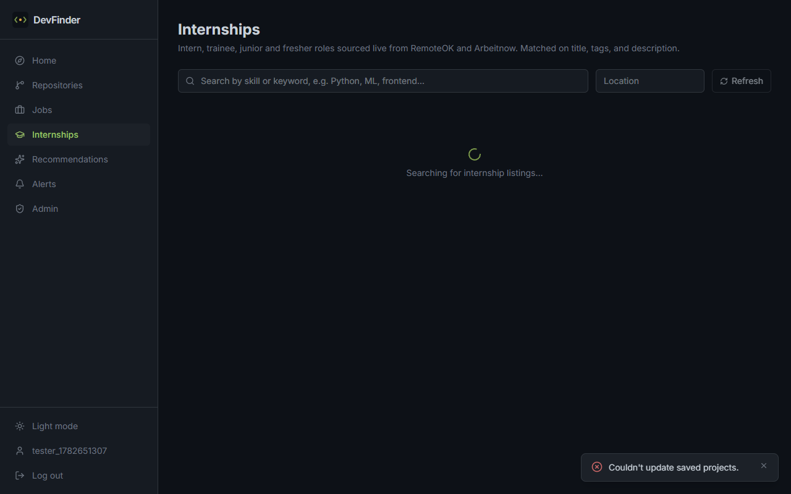
    </td>
  </tr>
</table>

### Personalization & Admin
<table width="100%">
  <tr>
    <td width="50%">
      <p align="center"><b>Opportunity Email Alerts Setup</b></p>
      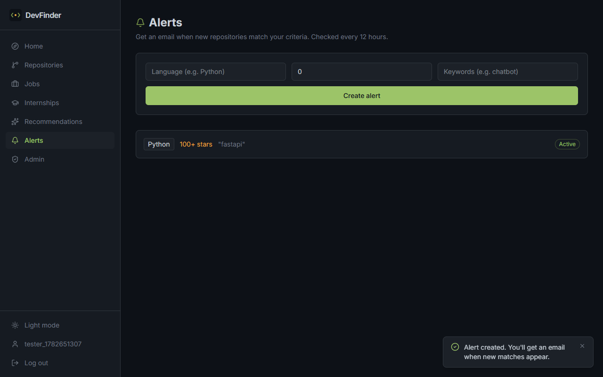
    </td>
    <td width="50%">
      <p align="center"><b>Developer Profile & Bookmarks</b></p>
      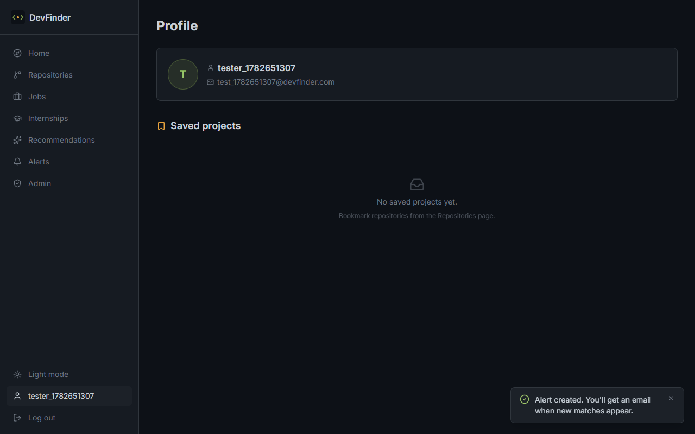
    </td>
  </tr>
  <tr>
    <td colspan="2">
      <p align="center"><b>Admin Statistics & Recharts Analytics</b></p>
      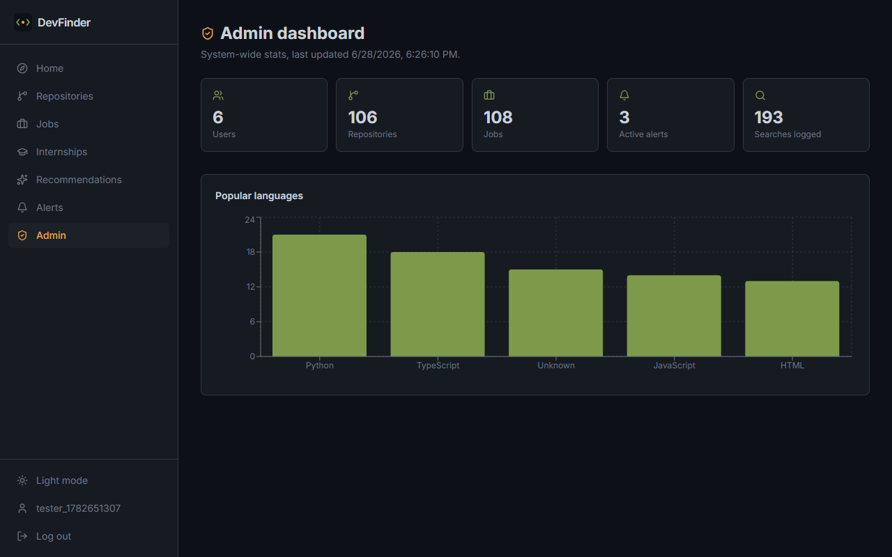
    </td>
  </tr>
</table>

---

## 🛡️ Security Implementation

- **🔒 Token-Based Security**: API routers are protected by JWT Bearer tokens signed with a server-side `JWT_SECRET_KEY` using the `HS256` algorithm.
- **🛡️ Row Level Security (RLS)**: Tables are secured in Supabase. Public access is restricted to read-only views for public repository lists and jobs. All other mutations or user-specific records are blocked.
- **🗝️ Safe Backend Privileges**: The backend FastAPI server utilizes the admin `service_role` key to bypass RLS safely, keeping user credentials away from client-side network inspectors.
- **🔑 Secure Password Handling**: Passwords are encrypted before database insertion using the **bcrypt** hashing algorithm.
- **🚫 API Rate Limiting**: Implements standard FastAPI **SlowAPI** middleware to rate limit endpoints based on client IP addresses, protecting against DDoS and automated form submission attacks.

---

## ⚡ Performance Optimizations

- **💾 Smart In-Memory Caching**: Implements a lightweight cache in the backend for job queries. External boards (RemoteOK, Arbeitnow, Adzuna) are cached for 30 minutes, preventing rate-limiting blocks and optimizing page speed.
- **⚡ Async I/O Operations**: Network calls to external APIs are non-blocking, using Python's `async/await` and thread pools (`ThreadPoolExecutor`) for parallel requests.
- **📉 Debounced User Input**: Search fields use debounced handlers to group keystrokes, reducing network traffic and GitHub API requests.
- **📦 Code Splitting & Dynamic Imports**: React Router handles lazy loading for major views, reducing the initial JavaScript bundle size.
- **🔍 Database Query Tuning**: Critical tables (e.g. `repositories`, `jobs`, `alerts`) use PostgreSQL indexes on frequently searched columns like `language`, `stars`, and `remote`.

---

## ⚠️ Known Limitations

1. **GitHub API Rate Limits**: Unauthorized clients are restricted to 60 requests/hour. To resolve this, configure a `GITHUB_TOKEN` in the `.env` configuration to increase the limit to 5000 requests/hour.
2. **Mocked Email Alerts**: If no verified sender domain is configured in Resend (e.g., using default `onboarding@resend.dev`), emails can only be sent to the account owner's email address.
3. **Regional Job Feeds**: The Adzuna integration is set to search inside India (`in`) by default. Developers targeting other locations must update the endpoint parameters in `backend/services/job_service.py` to match their target country code (e.g. `us`, `gb`, `ca`).

---

## 🗺️ Future Roadmap

- [ ] **Google Authenticator (2FA)**: Add Multi-Factor Authentication for admin and developer accounts.
- [ ] **Enhanced Analytics**: Advanced charts to show user activity logs and trends over time.
- [ ] **Real-Time Notification Center**: Push notifications for immediate alert updates inside the app.
- [ ] **Advanced Role Management**: Custom roles (e.g. Moderator, Reviewer) and permission controls.
- [ ] **Optimized PDF/CSV Export**: Allow users to export saved projects and aggregated jobs as a report.
- [ ] **AI-Powered Cover Letter Assistant**: Add a feature to generate customized job application cover letters using Groq AI.
- [ ] **PWA / Mobile Application**: Package the client application as a Progressive Web App (PWA) for mobile device installation.

---

## 🤝 Contributing

Contributions make the open-source community an amazing place to learn, inspire, and create. Any contributions you make are **greatly appreciated**.

1. Fork the Project.
2. Create your Feature Branch (`git checkout -b feature/AmazingFeature`).
3. Commit your Changes (`git commit -m 'Add some AmazingFeature'`).
4. Push to the Branch (`git push origin feature/AmazingFeature`).
5. Open a Pull Request.

---

## 📄 License

Distributed under the MIT License. See licensing files for more information.

---

## 👥 Authors

- **Jasintha Shankar** - *Initial Work & Architecture* - [@jasinthashankar](https://github.com/jasinthashankar)

---

## 📞 Contact

- **GitHub Link:** [https://github.com/jasinthashankar/Devfinder](https://github.com/jasinthashankar/Devfinder)
- **Project Link:** [https://devfinder-pied-eta.vercel.app](https://devfinder-pied-eta.vercel.app)